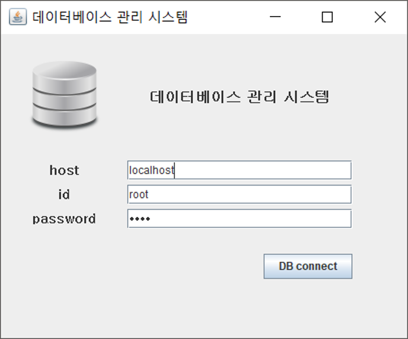
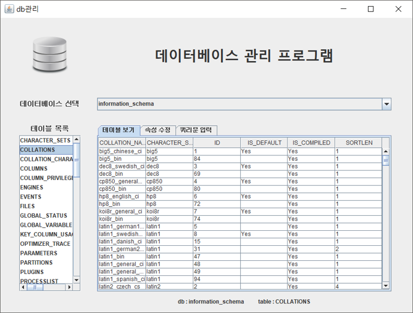
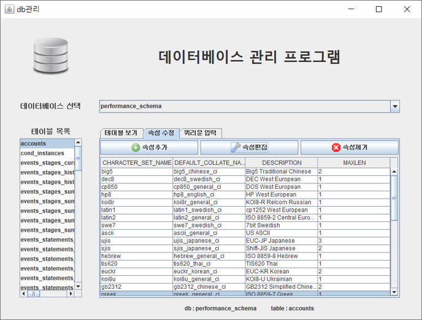
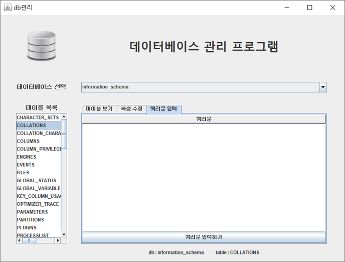

Java Swing기반 데이터베이스 관리 시스템
============
기능
1. 데이터베이스 접속
    {: width="300" height="300"}
2. 테이블 확인
    {: width="300" height="300"}
3. 테이블 수정
    {: width="300" height="300"}
4. 쿼리 입력
    {: width="300" height="300"}
------------

